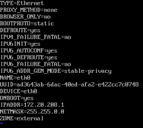

# Mini-Hack Configuration


## Router    
**Networking**
Restarting Network Services
```bash
sudo systemctl restart network
```

*External Configuration*:
```bash
sudo vi /etc/sysconfig/network-scripts/ifcfg-eth0
```
*Changes*
```vim
BOOTPROTO=static
ONBOOT=yes
IPADDR=172.20.208.1
NETMASK=255.255.0.0
ZONE=external
```


*External Configuration*:
```bash
sudo vi /etc/sysconfig/network-scripts/ifcfg-eth1
```
*Changes*
```vim
BOOTPROTO=static
ONBOOT=yes
IPADDR=192.168.208.1
NETMASK=255.255.255.0
ZONE=internal
```


*Routing Traffic*
List all firewall zones
```bash
sudo firewall-cmd --list-all --zone=external
```
Forwarding traffic from external to internal
```bash
sudo firewall-cmd --permanent --zone=external --add-forward-port=port=80:proto=tcp:toport=80:toaddr=192.168.208.2
```
Restarting firewall
```bash
sudo firewall-cmd --reload
```

## Web Server
*Check for IP Address*
```bash
ip a 
```
*Popular Network Management Tools and how to check them*
```bash
//Checks NetworkManager service
sudo service network-manager status
//Status of systemd-networkd
sudo systemctl status systemd-networkd
//Lists the Netplan configuration files
sudo ls /etc/netplan
/List network devices managed by NetworkManager
nmcli device
```

*Example Configuration of Netplan*
```bash
sudo nano /etc/netplan/50-cloud-init.yaml
```

*Changes*
```vim
network:
  version: 2
  renderer: NetworkManager or systemd-networkd
  ethernets:
    ens18:
      addresses:
        - 192.168.208.2/24
      gateway4: 192.168.208.1
      nameservers:
        addresses: 
          - 192.168.208.x
```


*Restarting Network Services*
```bash 
sudo netplan apply
```

*Checking Apache and starting/enabling*
```bash
sudo systemctl status apache2
sudo systemctl start apache2
```

*Checking Web Server Content*
```bash
sudo nano /var/www/html/index.html
```

#Hardening the Web Server
*Updating and Upgrading Packages*
```bash
sudo apt update
sudo apt upgrade
```

*Changing the password for the root user*
```bash
sudo passwd root
```

*Checking for SSH service*
```bash
sudo systemctl status ssh
```
Configuration Files located in /etc/ssh/
* Important Files
  * sshd_config
  * ssh_config

Creating your own SSH key
```bash
ssh-keygen -t rsa -f /etc/ssh/ssh_host_rsa_key
```

Setting up Password-less Authentication Manually as the Server
```bash
//Generating a key pair
ssh-keygen -t rsa -f ~/id_mykey
//Moving the public key to .ssh/authorized_keys
//Any public key in this file will be allowed to log in
sudo cp ~/id_mykey.pub /root/.ssh/authorized_keys
//Checking the permissions
//Public keys must be 644, private keys must be 600
//.ssh must be 700 and owned by the user, authorized_keys must be 644 and owned by the user
sudo ls -l /root/.ssh/authorized_keys
sudo chmod 700 /root/.ssh
sudo chown root:root /root/.ssh
//Clients must have the private key to log in, from client Ownership of private key must be the user
scp user@server:/home/user/id_mykey .
//Login using the key file
ssh -i id_mykey user@server
```

*Setting up Password-less Authentication Automatically as the Server*
```bash
//Generating a key pair
ssh-keygen -t rsa -f ~/id_mykey
//Setting up the server to accept the key
sudo ssh-copy-id -i ~/id_mykey.pub user@server
```

## Firewall
*Ubuntu UFW*
Non user-rules are stored in /etc/ufw/before.rules and /etc/ufw/after.rules. Rules are applied in the order they are listed in the files.
Commands:
Checking the status of the firewall
```bash
sudo ufw status verbose
```
Enabling the firewall
```bash
sudo ufw enable
```
Creating rules in UFW
```bash
//Allowing an IP
sudo ufw allow from 192.168.208.100
//Allowing a port
sudo ufw allow 80
//Allowing a IP and port
sudo ufw allow from 192.168.208.100 to any port 80
//Disallowing a IP
sudo ufw deny from 192.168.208.0/24
//Disallowing a port
sudo ufw deny 80
//Can use protocols
sudo ufw allow http
```

Deleting Rules by Number
```bash
sudo ufw status numbered
sudo ufw delete 1
```

Reload the firewall
```bash
sudo ufw reload
```
Resetting the firewall
```bash
sudo ufw reset
```

## Active Connection Defense
Seeing active connections
-tunapl: t is for tcp, u is for udp, l is for listening, p is for program name, n is for numeric, a is for listening sockets
```bash
sudo netstat -tulpna
```
Killing a potential threat
```bash
sudo kill -9 <PID>
```
See who is used logged in by username
```bash
//:0 on FROM means the user is logged in locally
w
```
Killing by UserID
```bash 
sudo pkill -KILL -u <UserID>
```
Seeing current processes
```bash
ps aux
top
```

## Blue Team Field Manual
**Identify (Scope)**
Ping Sweep for network:
```bash
nmap -sn -PE <IP Address>
```
Scan and show open ports:
```bash
nmap -sV -p- <IP Address> or nmap --open <IP Address>
```
Determine Open Services:
```bash
nmap -sV -p <Port> <IP Address>
```
Basic Nessus Scan:
```bash
nessus-cli scan <IP Address>
```
NMAP vulnerability scan:
```bash
nmap -sV --script vuln -p 22,80,443 <target_ip>
```
**Protect (Defend)**
Service Information:
```bash
service --status-all
ps -ef
ps -aux
```
Example of start, stop, restart, and status of a service:
```bash
service <service_name> start
service <service_name> stop (stops only until reboot)
service <service_name> restart
service <service_name> status
```
Log all denied UFW rules:
```bash
sudo nano /etc/ufw/ufw.conf
//Uncomment to enable logging
LOGLEVEL=full
sudo ufw reload
sudo grep "\[UFW BLOCK\]" /var/log/syslog
```
Change Passwords:
```bash
sudo passwd <username> (For current user)
passwd <username> (For other users)
sudo su password (For root)
``` 
**Detect (Visibility)**
View traffic with timestamps and don't convert addresses and be verbose:
```bash
tcpdump -tttt -n -vv
```
Authentication logs in Ubuntu:
```bash
cat /var/log/auth.log
grep -i "fail" /var/log/auth.log
```
Look at cron activity:
```bash
grep -i cron /var/log/syslog
```
Look at sudo activity:
```bash
grep -i sudo /var/log/syslog
```
**Respond (Analysis)**
View Logged in Users:
```bash
w
```
Show if a user has ever logged in remotely:
```bash
lastlog
last
```
View failed login attempts:
```bash
faillog -a
```
View local user accounts:
```bash
cat /etc/passwd
cat /etc/shadow
```
View local groups:
```bash
cat /etc/group
```
View sudo access:
```bash
cat /etc/sudoers
```
View cron jobs:
```bash
crontab -l
```
Review for unusual cron jobs:
```bash
cat /etc/crontab
ls -al /etc/cron*
```
View root authorized SSH key authentications:
```bash
cat /root/.ssh/authorized_keys
```
List of files opened by users:
```bash
lsof -u <username>
```
View network connections:
```bash
netstat -tulpna
netstat -antup
```
**Record (Remediate)**
Reset root password in single user mode:
```bash
reboot -f
Press ESC at the GRUB menu
Select default entry and then press e to edit
Scroll down to the line that starts with linux16, linux, or linuxefi
At the end of that line leave a space and add without quotes: 'rw init=/bin/bash'
Press CTRL+X to boot
After reboot, the system should be in single user mode and you should be logged in as root
Change the root password
passwd
reboot -f
```
**Tactics (Tips & Tricks)**
Analyze traffic remotely over ssh:
```bash
ssh root@<Remote IP Address of host to sniff> tcpdump -i any -U -s 0 -w 'not port 22'
```
Copy files to remote system:
```bash
scp <FILE NAME> <USER NAME>@<DESTINATION IP ADDRESS>:/<REMOTE FOLDER>
```

## Other Tips
*Configuring SSH*
* Change the default port
* Disable root login
* Enable public key authentication
* Disable password authentication
```bash
sudo nano /etc/ssh/sshd_config
sudo systemctl restart ssh
```
*Lynis Auditing Tool*
```bash
sudo apt install git
git clone https://github.com/CISOfy/lynis
cd lynis
sudo ./lynis audit system
```
*AIDE File Integrity Checker*
```bash
sudo apt install aide
sudo aideinit
//This command creates a new AIDE database with the current state of your system. The database will be used as a reference for future checks.
sudo mv /var/lib/aide/aide.db.new.gz /var/lib/aide/aide.db.gz
//Update the AIDE configuration (optional):
sudo nano /etc/aide/aide.conf
//Run AIDE to check for changes:
//This command compares the current state of your system with the AIDE database. Review the output for any unauthorized changes to files or directories
sudo aide.wrapper --check
Update the AIDE database (after confirming the changes are legitimate):
sudo aide.wrapper --update
```
*See Failed logins*
```bash
sudo lastb
```

## IPPSEC Videos
