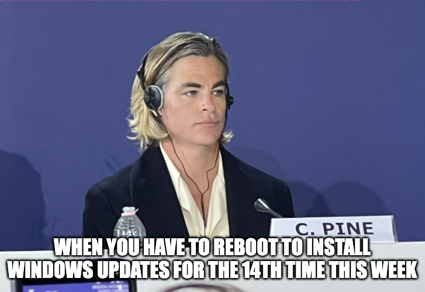

# CTF Writeup: NCL Spring 2023 Individual Game

## Challenge Name: Steg (Hard)

### Challenge Description:
Cyber Command

We've intercepted this image off a hard drive which allegedly contains a secret message, we see there's some weird distortions on the image, but can't find any meaningful data.

### Challenge Questions:

1. What is the hidden flag?

### Solution:

#### Step 1: Identify the format of the document information

#### Step 2: Use a decoder to decode the document information

#### Step 3: Provide answers to the challenge questions

#### Final Answer

1. SKY-PINE-3054

## Conclusion:

## Excerpts from Methodologies and techhniques used from NCL Discord
`zsteg worked like a charm`
`fotoforensics will show red pixels tampered with
from there, it's just finding the data hidden in the red bits`