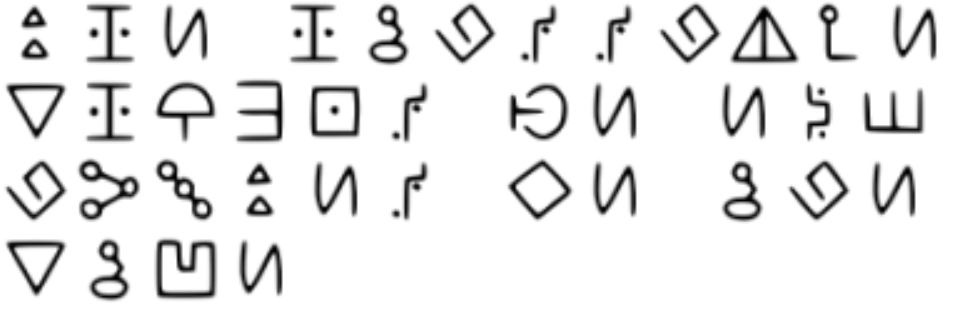

# CTF Writeup: NCL Spring 2023 Individual Game

## Challenge Name: Esoteric (Medium)

### Challenge Description:

We have obtained a message but we don't know how to decipher it. Can you find the message?

### Challenge Questions:

1. What is the cipher called?
2. What is the message?

### Solution:

I used the following steps to solve the challenge:

#### Step 1: Put image in Google Lens

To identify the ciphertext, I put the image in Google Lens. This identified the ciphertext as a something from Gravity Falls.

#### Step 2: Find a website that shows all the ciphers in Gravity Falls

I found a website that showed all the ciphers in Gravity Falls: https://gravityfalls.fandom.com/wiki/List_of_cryptograms/Episodes

#### Step 3: Find appropriate cipher and decode ciphertext

I used Bill's symbol substitution cipher to decode the ciphertext.

#### Answers
1. The cipher is called Bill's symbol substitution cipher
2. The message is "the hard drive should be encrypted we are safe"

## Conclusion:

The Esoteric (Medium) challenge required using a website to identify the cipher used to encode a message. By completing this challenge, I learned about the Bill's symbol substitution cipher and how it is used to encode messages.

## Excerpts from Methodologies and techhniques used from NCL Discord
`https://www.dcode.fr/tools-list`