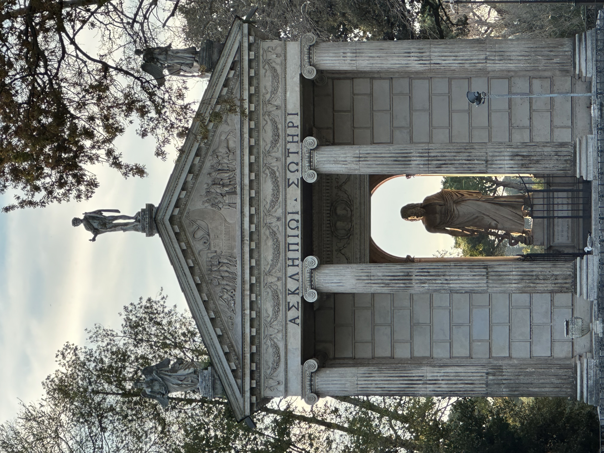

# CTF Writeup: NCL Spring 2023 Individual Game

## Challenge Name: Greek (Medium)

### Challenge Description:

We intercepted this picture as the rendezvous point for a potential meetup for people selling some stolen information. It looks like it's Greek, but we can't seem to find it in Greece, can you help us find it?

### Challenge Questions:

1. What city was this picture taken in? 

### Solution:

I used the following steps to solve the challenge:

#### Step 1: Put image in Google Lens

To identify the image, I put the image in Google Lens. This identified the image as a picture of the Acropolis in Athens, Greece.

#### Answers
1. The city was Rome, Italy.

## Conclusion:

The Greek (Medium) challenge required using Google Lens to identify a picture. By completing this challenge, I learned about Google Lens and how it can be used to identify pictures.

## Excerpts from Methodologies and techhniques used from NCL Discord
`Google Image Search`